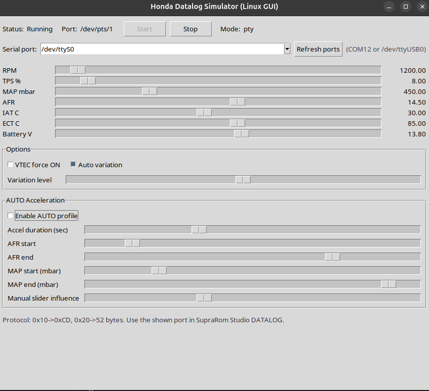

# Ostrich Simulator - OneROM Datalog

Simulateur DATALOG dedie a l'usage avec OneROM et Ostrich.

## Scope

Ce package sert uniquement a:
- simuler des trames DATALOG compatibles Honda Studio / OneROM
- tester les ecrans live sans brancher un ECU reel
- valider le flux de lecture via port serie virtuel (PTY Linux)

Ce package ne sert pas a flasher OneROM ni a programmer Ostrich.

## Contenu du repo

- `LINUX-DATALOG-SIM.zip`
- `source/` (codes source modifiables du simulateur)

Le ZIP contient:
- `honda_datalog_simulator_gui.py` (version visuelle)
- `honda_datalog_simulator.py` (version headless)
- scripts de lancement Linux
- script d'installation des dependances Ubuntu

## Codes source (modifiables)

Tous les scripts source sont egalement disponibles directement dans:

- `source/honda_datalog_simulator_gui.py`
- `source/honda_datalog_simulator.py`
- `source/honda_datalog_simulator_com.py`
- `source/Start-Honda-Datalog-GUI.sh`
- `source/install-deps-ubuntu.sh`
- `source/requirements.txt`

## Installation (Linux)

1. Cloner le repo:

```bash
git clone https://github.com/johanputzolu-cmd/ostrich-simulator.git
cd ostrich-simulator
```

2. Extraire le package:

```bash
unzip LINUX-DATALOG-SIM.zip
```

3. Installer les dependances (Ubuntu/Debian):

```bash
cd "LINUX DATALOG SIM"
./install-deps-ubuntu.sh
```

## Lancement

### Mode visuel (recommande)

```bash
cd "LINUX DATALOG SIM"
./Start-Honda-Datalog-GUI.sh
```

Ensuite dans la fenetre GUI:
1. Cliquer `Start`
2. Recuperer le port affiche (ex: `/dev/pts/7`)

## Screenshot de l'app



### Mode auto (headless)

Si present dans votre copie locale:

```bash
cd "LINUX DATALOG SIM"
./Start-Honda-Datalog-AUTO.sh
```

## Ou l'utiliser (OneROM / Ostrich)

Dans Honda Studio / OneROM:
1. Ouvrir la section `DATALOG`
2. Cliquer `SCAN`
3. Selectionner le port PTY affiche par le simulateur (ex: `/dev/pts/7`)
4. Cliquer `CONNECT`

Vous verrez les graphes live bouger comme en acquisition reelle.

## Notes Ostrich

Le simulateur alimente la partie DATALOG de l'application.
Le port Live ROM/Ostrich est un flux different: ne pas confondre avec le port PTY du simulateur.

## Depannage rapide

- Erreur tkinter:

```bash
sudo apt-get update
sudo apt-get install -y python3-tk
```

- Erreur pyserial:

```bash
python3 -m pip install --user pyserial
```

- Aucun port visible:
  - verifier que le simulateur est bien lance
  - relancer `SCAN` dans la section DATALOG
  - verifier le port `/dev/pts/X` affiche par la GUI
